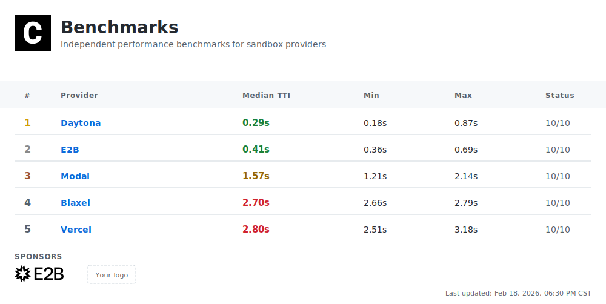

[](https://github.com/computesdk/benchmarks/actions/workflows/benchmarks.yml)
[](./LICENSE)

**TTI (Time to Interactive)** = API call to first command execution. Lower is better.

<br>

## Sponsors

<a href="https://e2b.dev"></a>

Sponsors fund large-scale infrastructure tests. **Sponsors cannot influence methodology or results.**

[Become a sponsor →](./SPONSORSHIP.md)

<br>

## What We Measure

**Daily: Time to Interactive (TTI)**

```
API Request → Provisioning → Boot → Ready → First Command
└───────────────────── TTI ─────────────────────┘
```

Each benchmark creates a fresh sandbox, runs `echo "benchmark"`, and records wall-clock time. 10 iterations per provider, every day, fully automated.

**Sponsor-only tests coming soon:** Stress tests, warm starts, multi-region, and more. [See roadmap →](#roadmap)

[Full methodology →](./METHODOLOGY.md)

<br>

## Run It Yourself

```bash
git clone https://github.com/computesdk/benchmarks.git
cd benchmarks && npm install
cp env.example .env  # Add your API keys
npm run bench
```

<br>

## Transparency

| | |
|:--|:--|
| Open source | All benchmark code is public |
| Raw data | Every result committed to repo |
| Reproducible | Anyone can run the same tests |
| Automated | Daily runs via GitHub Actions |
| Independent | Sponsors cannot influence results |

<br>

## Roadmap

| When | What |
|:-----|:-----|
| Q2 2026 | benchmarks.computesdk.com |
| Q2 2026 | 10,000 concurrent sandbox stress test |
| Q3 2026 | Cold start vs warm start metrics |
| Q3 2026 | Multi-region testing |
| Q4 2026 | Cost-per-sandbox-minute |

<br>

---

MIT License
